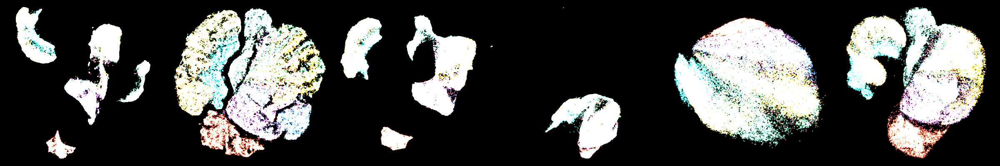

# mlx-vis

Pure MLX + NumPy implementations of UMAP, t-SNE, PaCMAP, and NNDescent for Apple Silicon. No scipy, no sklearn - just Metal GPU acceleration via MLX.



## Install

```bash
uv pip install mlx-vis
```

From source:

```bash
git clone --recurse-submodules https://github.com/hanxiao/mlx-vis.git
cd mlx-vis
uv pip install .
```

## Usage

```python
import numpy as np
from mlx_vis import UMAP, TSNE, PaCMAP, NNDescent

X = np.random.randn(10000, 128).astype(np.float32)

# UMAP
Y = UMAP(n_components=2, n_neighbors=15).fit_transform(X)

# t-SNE
Y = TSNE(n_components=2, perplexity=30).fit_transform(X)

# PaCMAP
Y = PaCMAP(n_components=2, n_neighbors=10).fit_transform(X)

# NNDescent (approximate k-NN graph)
indices, distances = NNDescent(k=15).build(X)
```

Submodule imports also work:

```python
from mlx_vis.umap import UMAP
from mlx_vis.tsne import TSNE
from mlx_vis.pacmap import PaCMAP
from mlx_vis.nndescent import NNDescent
```

## Methods

| Method | Class | Main API | Output |
|--------|-------|----------|--------|
| UMAP | `UMAP(n_components, n_neighbors, min_dist, ...)` | `fit_transform(X)` | `np.ndarray (n, d)` |
| t-SNE | `TSNE(n_components, perplexity, ...)` | `fit_transform(X)` | `np.ndarray (n, d)` |
| PaCMAP | `PaCMAP(n_components, n_neighbors, ...)` | `fit_transform(X)` | `np.ndarray (n, d)` |
| NNDescent | `NNDescent(k, n_iters, ...)` | `build(X)` | `(indices, distances)` |

## Visualization

### Static plots

Requires `matplotlib` (not installed by default).

```python
from mlx_vis import UMAP, scatter
import numpy as np

X = np.random.randn(10000, 128).astype(np.float32)
labels = np.random.randint(0, 5, 10000)
Y = UMAP(n_components=2).fit_transform(X)

scatter(Y, labels=labels, theme="dark", save="plot.png")
```

### GPU-accelerated animation

`animate_gpu` renders directly on Metal GPU via MLX circle-splatting, then pipes raw RGBA frames to ffmpeg with `h264_videotoolbox` hardware encoding. No matplotlib in the rendering loop. 500 frames of 15K points render in ~1.5 seconds on M3 Ultra (60x faster than matplotlib).

| UMAP | t-SNE | PaCMAP |
|------|-------|--------|
| <video src="https://github.com/hanxiao/mlx-vis/releases/download/v0.1.1/umap-animation.mp4" width="280" autoplay loop muted></video> | <video src="https://github.com/hanxiao/mlx-vis/releases/download/v0.1.1/tsne-animation.mp4" width="280" autoplay loop muted></video> | <video src="https://github.com/hanxiao/mlx-vis/releases/download/v0.1.1/pacmap-animation.mp4" width="280" autoplay loop muted></video> |

**Benchmark on Fashion-MNIST 70,000 x 784, M3 Ultra:**

| | UMAP | t-SNE | PaCMAP |
|---|---|---|---|
| Iterations | 500 | 500 | 450 |
| Embedding | 3.5s | 3.9s | 2.4s |
| GPU render (800 frames) | 1.4s | 1.3s | 1.2s |
| Total | 4.9s | 5.2s | 3.6s |

```python
from mlx_vis import UMAP, animate_gpu
import numpy as np, time

X = np.random.randn(10000, 128).astype(np.float32)
labels = np.random.randint(0, 5, 10000)

snaps, times = [], []
t0 = time.time()
def cb(epoch, Y_np):
    snaps.append(Y_np.copy())
    times.append(time.time() - t0)

Y = UMAP(n_components=2, n_epochs=200).fit_transform(X, epoch_callback=cb)

animate_gpu(snaps, labels=labels, timestamps=times,
            method_name="umap-mlx", fps=120, theme="dark",
            save="animation.mp4")
```

The CPU fallback `animate()` uses matplotlib and is available for non-Mac platforms.

Full Fashion-MNIST example:

```bash
python -m mlx_vis.examples.fashion_mnist --method umap --theme dark
python -m mlx_vis.examples.fashion_mnist --method all
```

## Dependencies

- `mlx >= 0.20.0`
- `numpy >= 1.24.0`

## License

Apache-2.0
